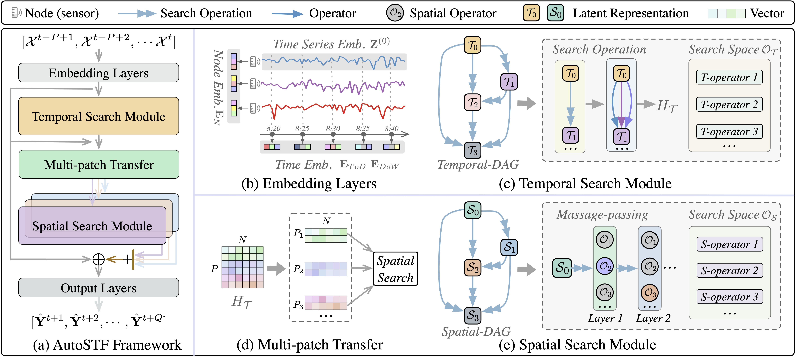

# AutoSTF: Decoupled Neural Architecture Search for Cost-Effective Automated Spatio-Temporal Forecasting

<p align="center">


</p>

<p align="center">

| **[1 Introduction](#1-introduction)** 
| **[2 Requirements](#2-requirements)**
| **[3 Datasets](#3-dataset)**
| **[4 Usage](#4-usage)**
| **[5 Acknowledgements](#5-acknowledgements)**

</p>

<a id="introduction"></a>
## 1 Introduction

Official code for article "AutoSTF: Decoupled Neural Architecture Search for Cost-Effective Automated Spatio-Temporal Forecasting", **KDD 2025 Research Track**. 

Spatio-temporal forecasting is a critical component of various smart city applications, such as transportation optimization, energy management, and socio-economic analysis. Recently, several automated spatio-temporal forecasting methods have been proposed to automatically search the optimal neural network architecture for capturing complex spatio-temporal dependencies. However, the existing automated approaches suffer from expensive neural architecture search overhead, which hinders their practical use and the further exploration of diverse spatio-temporal operators in a finer granularity. In this paper, we propose AutoSTF, a decoupled automatic neural architecture search framework for cost-effective automated spatio-temporal forecasting. From the efficiency perspective, we first decouple the mixed search space into temporal space and spatial space and respectively devise representation compression and parameter-sharing schemes to mitigate the parameter explosion. The decoupled spatio-temporal search not only expedites the model optimization process but also leaves new room for more effective spatio-temporal dependency modeling. From the effectiveness perspective, we propose a multi-patch transfer module to jointly capture multi-granularity temporal dependencies and extend the spatial search space to enable finer-grained layer-wise spatial dependency search. Extensive experiments on eight datasets demonstrate the superiority of AutoSTF in terms of both accuracy and efficiency. Specifically, our proposed method achieves up to 13.48x speed-up compared to state-of-the-art automatic spatio-temporal forecasting methods while maintaining the best forecasting accuracy.

<div style="display: flex; justify-content: center;">
  
</div>


<a id="requirements"></a>
## 2 Requirements

`python=3.9`, `torch=1.13.1+cu116`, `numpy=1.26.4`, `pandas=2.2.2`, `scipy=1.13.0`, `dgl=0.9.1`

<a id="Dataset"></a>
## 3 Dataset

AutoSTF is compatible with several public datasets for spatio-temporal forecasting. 
Below are the details and download links for each dataset:

### Traffic Datasets
- **METR-LA and PEMS-BAY**: Download from the following sources:
  - [Google Drive](https://drive.google.com/drive/folders/10FOTa6HXPqX8Pf5WRoRwcFnW9BrNZEIX) (provided by DCRNN)
  - [Baidu Yun](https://pan.baidu.com/s/14Yy9isAIZYdU__OYEQGa_g) (provided by DCRNN)
  - For more information, visit the [DCRNN GitHub repository](https://github.com/liyaguang/DCRNN).

- **PEMS03, PEMS04, PEMS07, PEMS08**: Available from the STSGCN project (AAAI-20). For more details, check out the [STSGCN GitHub repository](https://github.com/Davidham3/STSGCN).

### Energy Datasets
- **Solar-Energy and Electricity**: Directly accessible at:
  - [Multivariate Time Series Data GitHub repository](https://github.com/laiguokun/multivariate-time-series-data).
  - After downloading, unzip the files and transfer them to the `dataset` folder.

<a id="usage"></a>
## 4 Usage

The first step involves searching for the optimal neural architecture for a specific dataset:

```
python search.py
```

The second step involves training this optimal neural architecture:

```
python train.py
```

<a id="acknowledgements"></a>
## 5 Acknowledgements

We extend our sincere gratitude to the teams and contributors behind the development of [AutoCTS](https://github.com/WXL520/AutoCTS), [AutoSTG](https://github.com/AutoSTG/AutoSTG). 
Their pioneering work in automated spatio-temporal forecasting models has significantly influenced our research and the development of the AutoSTF model. 
Their contributions to the field have been invaluable, and we appreciate their efforts in advancing the state of the art.
